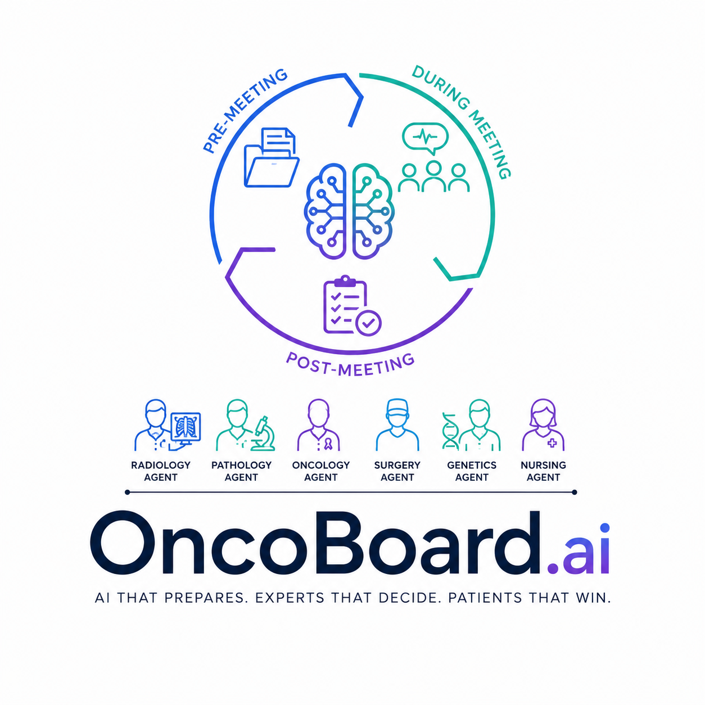

<p align="center">
  
</p>

<h1 align="center">OncoBoard.ai</h1>

<p align="center"><em>AI that prepares. Experts that decide. Patients that win.</em></p>

<p align="center">
  
  
  
  
  
  
</p>

---

**Live demo:** [https://onco-board-ai.vercel.app/](https://onco-board-ai.vercel.app/)

> Built for the **[AI Agent Olympics Hackathon](https://lablab.ai/ai-hackathons/milan-ai-week-hackathon)** by Lablab.ai — Google DeepMind track.

---

## The Problem

Preparing a single breast cancer case for a multidisciplinary tumor board takes **eight hours** of manual work — pulling records, checking guidelines, searching trials, writing a summary. OncoBoard.ai runs a coordinated team of AI agents that does all of it in under 8 minutes.

**Clinicians make every decision. The agents remove the busywork.**

---

## Multi-Agent Pipeline

The system is organized into three phases with a hard human gate between each.

### Pre-Meeting — 7 agents, run in parallel

| Agent | Role |
|---|---|
| `CaseCompiler` | Pulls the patient record, flags missing data |
| `RadiologyAgent` | Imaging findings in BI-RADS radiologist language |
| `PathologyAgent` | Biopsy + genomic interpretation in CAP synoptic format |
| `GuidelineAgent` | NCCN / ESMO protocol match for stage + receptor status |
| `TrialAgent` | ClinicalTrials.gov recruiting trials + PubMed evidence, matched on receptor status, stage, and prior treatment |
| `HistoryCaseAgent` | Analogous past cases by clinical profile similarity (RAG — see below) |
| `SummaryAgent` | One-page structured clinical narrative from all agent outputs |

**→ Human Gate 1: Clinician reviews and approves before the board.**

### During Meeting — live capture

| Agent | Role |
|---|---|
| `DisplayAgent` | Formats the prepared case for real-time display in the room |
| `TranscriptionAgent` | Live audio → speaker-tagged transcript |
| `RecommendationAgent` | Reads the transcript stream, captures decision moments as consensus forms |

**→ Human Gate 2: Consensus confirmed.**

### Post-Meeting — note + follow-up

| Agent | Role |
|---|---|
| `NoteDraftAgent` | Structured tumor board note ready for EHR entry |
| `ActionDispatchAgent` | Extracts action items, assigns owners, sets due dates |
| `FollowUpAgent` | Tracks completion, escalates overdue items |
| `SchedulingAgent` | Flags cases needing re-presentation |

**→ Human Gate 3: Clinician approves the note.**

---

## RAG — Clinical Chat

A key feature of OncoBoard.ai is the **in-board chat**, powered by `ClinicalContextAgent`. During any phase of the tumor board, a clinician can ask a question in plain language and get an answer grounded strictly in the current patient's data.

On every question, the agent assembles a full context window from everything in the DB for that case — the clinical record, all agent outputs, the live transcript, and action items — and passes it to Gemini Pro. The answer is always derived from that retrieved context, never from LLM memory or general knowledge.

This means a radiologist can ask *"what did the pathology show?"*, a surgeon can ask *"is this patient eligible for the MONARCH trial?"*, and a coordinator can ask *"what actions are still open?"* — all without leaving the board view. The agent never fabricates data and never makes a treatment recommendation.

---

## Tech Stack

| Layer | Choice |
|---|---|
| API | FastAPI + Server-Sent Events (agent output is server → client; SSE avoids WebSocket complexity) |
| LLM | Google Gemini — Pro for clinical interpretation, Flash for structured extraction, Vision for imaging |
| Frontend | Vue.js 3 + Pinia |
| Data | TCGA-BRCA (Kaggle) — 1,097 patients, clinical + genomic + imaging columns |

---

## Deployment

The app is live at **[https://onco-board-ai.vercel.app/](https://onco-board-ai.vercel.app/)**.

Two branches serve different environments:

| Branch | Environment | Database | Storage |
|---|---|---|---|
| `master` | Local development | SQLite (aiosqlite) | Local filesystem |
| `vercel-deployment` | Vercel production | Vercel Postgres | Vercel Blob |

The `vercel-deployment` branch replaces SQLite with Vercel Postgres and local file storage with Vercel Blob, plus minor backend adjustments for the serverless runtime. Feature parity is maintained across both.

---

## Quickstart (local)

```bash
git clone https://github.com/RaneemK-commits/OncoBoard.ai.git
cd OncoBoard.ai

python -m venv .venv
.venv/bin/pip install -r requirements.txt        # Linux/macOS
# .\.venv\Scripts\pip install -r requirements.txt  # Windows

cp .env.example .env   # set GEMINI_API_KEY, or GEMINI_MOCK=1 for offline dev

# Seed the DB (choose one)
python -m src.db.init_db
python -m src.data.seed_synthetic        # 4 hand-crafted cases, instant
# python -m src.data.seed_tcga           # 1,097 TCGA-BRCA cases (needs Kaggle CSVs)

uvicorn src.main:app --reload
# http://localhost:8000/health → {"status":"ok"}
```

---

## Disclaimer

OncoBoard.ai is a **research prototype**.
